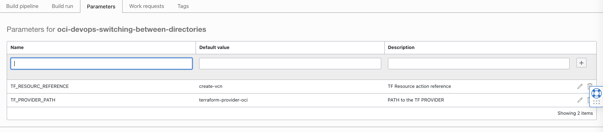

This is a fork with multiple TF exmaple of various CSP .

Add - ons 

-----

- Added build_spec.yaml to use it behind an OCI devops build pipeline.
  -  documentation - https://docs.oracle.com/en-us/iaas/Content/devops/using/home.htm 

  - We do use two build params to call the contents dynamically change the tf root path.

       

  - This will help to switch TF root with parameters while invoking the build pipelines (be it via console ,cli ,api sdks or via terraform).


- An example of build run with OCI CLI as follows 

```
oci devops build-run create --build-pipeline-id ocid1.devopsbuildpipeline.oc1.iad.xxxx --build-run-arguments '{ "items": [ { "name": "TF_RESOURC_REFERENCE", "value": "create-vcn" }, { "name": "TF_PROVIDER_PATH", "value": "terraform-provider-oci" } ] }'
```

    - OCI CLI documentation - https://docs.oracle.com/en-us/iaas/Content/devops/using/run_build.htm#runbuild_cli 
    - Details view of OCI CLI with build run - https://docs.oracle.com/en-us/iaas/tools/oci-cli/3.4.4/oci_cli_docs/cmdref/devops/build-run.html 